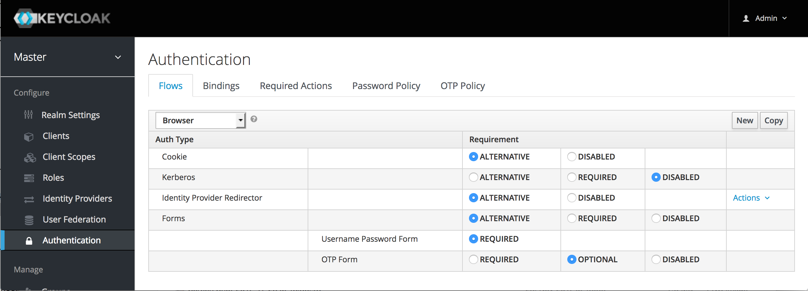
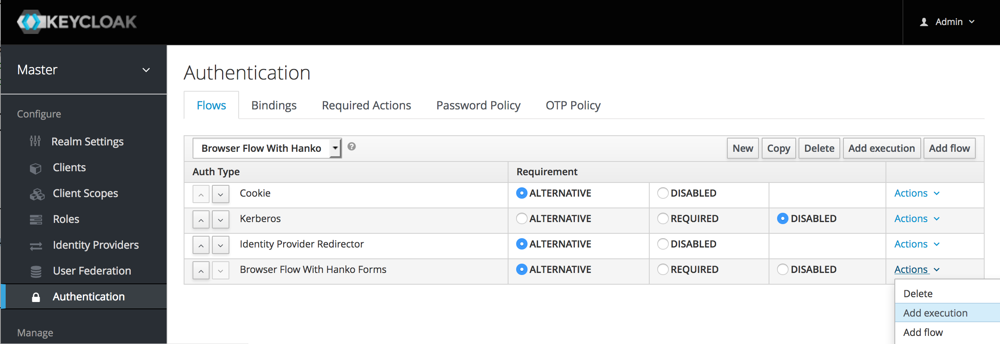
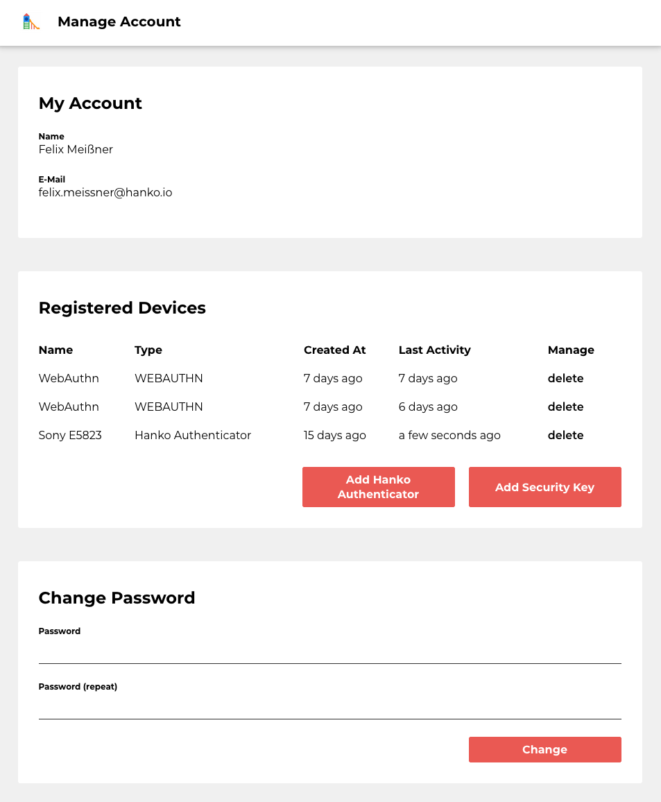
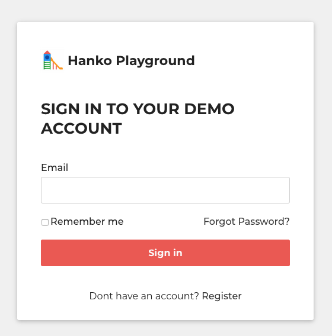
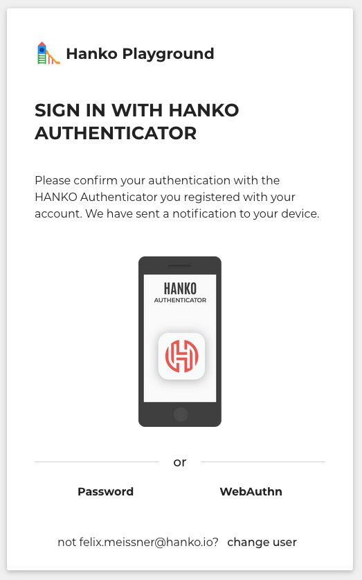
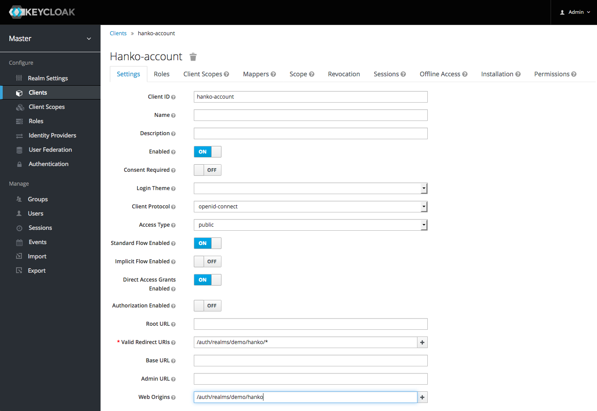

# Hanko Plugin for Keycloak

This is an extension to Keycloak which integrates passwordless authentication via Hanko.

For more information about Keycloak, please visit the [Keycloak homepage](https://www.keycloak.org/).

For more information about Hanko, please visit the [Hanko homepage](https://hanko.io/).

## Features

- Login with either password or Hanko Authenticator
- Account-page to register and deregister a Hanko Authenticator
- REST endpoints to allow registration and deregistration of a Hanko Authenticator

## Compatibility

This plugin is currently developed for Keycloak 4.1.0.Final.

## Installation

1. Download the latest version from the [releases page](https://github.com/teamhanko/hanko-keycloak-plugin/releases).
2. Copy the ear file into the `standalone/deployments` directory of your Keycloaks root directory. 
3. Copy templates.zip to the root directory of you Keycloak server.
4. Unzip templates.zip by running `unzip templates.zip`

## Configuration

1. Login to your Keycloak administration console.
2. Goto configuration section **Authentication**.
3. Select the **Browser** authentication flow.
4. Click **copy** in the top right corner of the table.

5. Give the new flow a meaningfull name, for example **Browser flow with Hanko**.

6. Delete the action **Username Password Form**.
7. Delete the action **OTP Form**.

8. Add the execution flow **Hanko Authenticator** to the forms flow and mark it as **required**.

9. Add the execution flow **Hanko UAF Auth** and mark it as **optional**.
10. Open the configuration of the **Hanko UAF Auth** flow by clicking **Actions** -> **Config** and insert your apikey. 

11. Open the **Bindings** tab and change the **Browser Flow** to **Browser flow with Hanko**.


## Usage

You can register or deregister a Hanko Authenticator either by:
- using the provided account page
- providing your own account page, which calls the provided api endpoints



After successful registration of a Hanko Authenticator, you can leave the password-field empty and instead confirm your login with the Hanko Authenticator.
As a fallback, you can still login with your password. 




### Account page

Before you can use the provided account page, you have to add a **Client** to your realm
**(Note: If you use another realm thean master, you have to replace master with your name in the URLs below)**:

1. Login to your Keycloak administration console.
2. Goto configuration section **Clients**.
3. Create a new client called **hanko-account** (in this step exact spelling matters) and leave the Root URL empty.

4. In the client configuration, set **Valid Redirect URIs** to **/auth/realms/master/hanko/***.
5. In the client configuration, add **/auth/realms/master/hanko** as Web Origin.

6. Save the hanko-account client configuration.

Now you can register and deregister a Hanko Authenticator by visiting the path `/auth/realms/master/hanko/status` at your Keycloak`s root-url.

### API Endpoints

If you prefer to provide a custom account page, you can use the API provided by the plugin.

Before you can use the API endpoints, you need to configure a client according to your needs:

1. Login to your Keycloak administration console.
2. Goto configuration section **Clients**.
3. Create a new client and enter the origin of your web application as the root URL.

6. Save the new client.

#### Example code

We provide a plain html/javascript based example which demonstrates, how the API can be called at [example-api-javascript](example-api-javascript).

Before you can run the example, you need to do a little configuration work: 
1. Adjust the url to your keycloak installation in **index.html** and in **keycloak.js**.
2. Also update the resource name in keycloak.js to the name of the client you have created in the previous step. 
3. Your can run the example with a dockerized nginx: `docker run -it -p 8888:80 -v  $(pwd)/example-api-javascript:/usr/share/nginx/html:ro nginx` 

#### API Description
Given your realm is called `demo`, the following URLs can be used to configure passwordless authentication:

##### Get Status

- URL: /auth/realms/demo/hanko
- Method: GET

Response is either 

```javascript
{ "isPasswordlessActive": false }
```

or

```javascript
{ "isPasswordlessActive": false }
```
.

##### Request Registration

- URL: /auth/realms/demo/hanko/register
- Method: POST

Response (example):

```javascript
{ qrCode: https://api.hanko.io/uaf/requests/1nIuGh4X4pavVtDrC1eUqIuTsUHJHYpRxasOhFmlSvEF/qrcode }
```

##### Await Registration Confirmation

- URL: /auth/realms/demo/hanko/register/complete
- Method: POST

```javasscript
{ "status": "OK" }
```

##### Deregistration

- URL: /auth/realms/demo/hanko/deregister
- Method: POST

Response:

```javascript
{ "isPasswordlessActive": false }
```

## Building

Ensure you have JDK 8 (or newer), Maven 3.1.1 (or newer) and Git installed:
```
java -version
mvn -version
git --version
```

Clone this repository:
```
git clone https://github.com/teamhanko/hanko-keycloak-plugin.git
cd hanko-keycloak-plugin
```

Build the plugin by running:
```
mvn package
```

## Testing with Vagrant

You can use the vagrant to create a development or test environment with pre-installed keycloak 4.1.0:

```
git clone https://github.com/teamhanko/hanko-keycloak-plugin.git
cd hanko-keycloak-plugin
vagrant up
./deploy_local
vagrant ssh
cd /opt/keycloak-4.1.0.Final
./bin/add-user-keycloak.sh -r master -u admin -p admin
./bin/standalone.sh -b 10.0.2.15
```

You should now be able to login to the admin console at https://localhost:8443/ with username admin and password admin.

## License

This product is licensed under the [Apache License 2.0](http://www.apache.org/licenses/LICENSE-2.0).